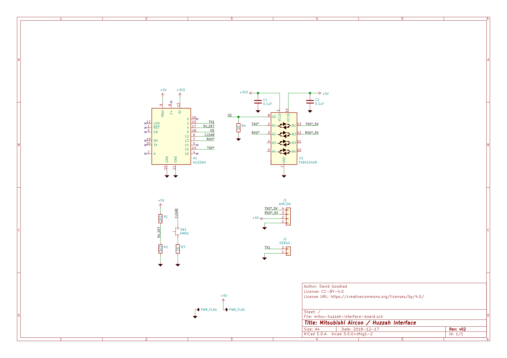

# ESP8266 / Mitsubishi AC interface

Software to control and monitor some Mitsubishi air conditioning units over MQTT
using an ESP8266-based wifi module.

Designed with the Adafruit HUZZAH breakout board in mind, this repo also
includes a PCB layout to do the requisite logic-level shifting etc.

**NOTE**: this information comes with _no warranty of any kind_. I do not claim
that any of the software or designs in this repository will work for your
particular hardware or situation. **MODIFYING AIR CONDITIONING UNITS IS
DANGEROUS AND YOU DO SO AT YOUR OWN RISK.***

## Supported Models

I haven't done any broad testing beyond the units in my own home. The underlying
library states that it has been

> Tested with Mitsubishi HeatPump MSZ-FH/GE (wall units) and SEZ-KD (ducted
> units)

and offers a wiki page listing its [Supported
Models](https://github.com/SwiCago/HeatPump/wiki/Supported-models). Check there
as a good place to start! Importantly, that page notes that

> if your unit has cn105 port, it is most likely supported

## Functional description

* Uses [WiFiManager](https://github.com/tzapu/WiFiManager/tree/development) for
  configuration via a captive portal access point
* GPIO12 acts as a "factory reset" button. When held low for 3 seconds, clears
  all settings configured by WiFiManager
* Uses the [HeatPump](https://github.com/SwiCago/HeatPump) library to handle
  comms with the aircon unit
* Uses [Async MQTT Client](https://github.com/marvinroger/async-mqtt-client) to
  communicate with your MQTT server. The messages are designed to line up with
  the expectations of the [Home Assistant](https://www.home-assistant.io/) [MQTT
  HVAC component](https://www.home-assistant.io/components/climate.mqtt/).
* Detects the presence of the aircon unit (rather than USB/FTDI/debug power) by
  looking for a high signal on GPIO4. The PCB implements this using a voltage
  divider to step the 5V power supply down to 3V3.
* If an aircon unit is detected:
    * Calls `Serial.swap()` to make UART0 use GPIO13/15 as RX/TX for the aircon
      serial communication. This avoids connecting the aircon to the default
      RX/TX pins that dump some debug/boot-time information from the ESP8266
      chip
    * Uses `Serial1` (UART1) to output debug logs on GPIO2 at 115200/8N1
* If _no_ aircon unit is detected
    * The heatpump code does not start, and no call to `Serial.swap()` is made.
    * Uses `Serial` (UART0) to output debug logs on GPIO1 (TX) at 115200/8N1
    * `Serial1` (UART1) is *not used*

## PCB




I used [OSH Park](https://oshpark.com/) to fabricate these PCBs, it cost about
10 USD with free shipping to 🇦🇺Australia🇦🇺 for three boards. I've made a shared
project there if you'd like to order the boards quickly: [](https://oshpark.com/shared_projects/LMoDw6sM)

Note that the HUZZAH is **revA** with _11 pin connectors_, not the newer 10-pin
version. The 11-pin version is just what I had a few of lying around, and they
have an extra no-connection (NC) pin between the power and GPIO pins on each
row. The order of the pins is _exactly the same_ and it would be straightforward
to modify the board layout to use the newer 10-pin version instead.

### Bill of Materials

You'll need the following to build the PCB:

| Reference(s) | Qty   | Value       | Description                                 | Datasheet                                                           | Digikey Part Number                                                                                                             | RS Components P/N                                                                          |
| ------------ | ----- | ----------- | -----------                                 | ---------                                                           | --------------------                                                                                                            | --------------------                                                                       |
| A1           | 1     | HUZZAH      | Adafruit HUZZAH (revA) breakout             | [link](https://learn.adafruit.com/adafruit-huzzah-esp8266-breakout) | [1528-1223-ND](https://www.digikey.com.au/product-detail/en/adafruit-industries-llc/2471/1528-1223-ND/5355489)                  |                                                                                            |
| C1, C2       | 2     | 0.1uF       | SMD 0603 Ceramic Capacitor                  | [link]()                                                            | [1276-6994-1-ND](https://www.digikey.com.au/product-detail/en/samsung-electro-mechanics/CL10B104KB85PNL/1276-6994-1-ND/7320636) |                                                                                            |
| J1           | 1     | AIRCON      | JST PH 4-pin Male Connector                 | [link](http://www.jst-mfg.com/product/pdf/eng/ePH.pdf)              | [455-1721-ND](https://www.digikey.com.au/product-detail/en/jst-sales-america-inc/S4B-PH-K-S(LF)(SN)/455-1721-ND/926628)         |                                                                                            |
| J2           | 1     | DEBUG       | 2-pin 0.1" pin header (male)                | [link]()                                                            | [S7000-ND](https://www.digikey.com.au/product-detail/en/sullins-connector-solutions/PPTC021LFBN-RC/S7000-ND/810142)             |                                                                                            |
| n/a          | 2     | 11-PIN      | 11-pin 0.1" pin header (female)             | [link]()                                                            | [S7009-ND](https://www.digikey.com.au/product-detail/en/sullins-connector-solutions/PPTC111LFBN-RC/S7009-ND/810150)             |                                                                                            |
| R1           | 1     | 2K2         | SMD 0603 Resistor                           | [link]()                                                            |                                                                                                                                 | [679-0112](https://au.rs-online.com/web/p/surface-mount-fixed-resistors/6790112/?sra=pstk) |
| R2           | 1     | 3K3         | SMD 0603 Resistor                           | [link]()                                                            |                                                                                                                                 | [679-0311](https://au.rs-online.com/web/p/surface-mount-fixed-resistors/6790311/?sra=pstk) |
| R3, R4       | 2     | 1K          | SMD 0603 Resistor                           | [link]()                                                            |                                                                                                                                 | [678-9875](https://au.rs-online.com/web/p/surface-mount-fixed-resistors/6789875/?sra=pstk) |
| SW1          | 1     | KMR2        | SMD tactile push-button switch              | [link](https://www.ckswitches.com/media/1479/kmr2.pdf)              |                                                                                                                                 | [135-9490](https://au.rs-online.com/web/p/tactile-switches/1359490/)                       |
| U1           | 1     | TXB0104DR   | 4-channel logic level shifter, SOIC package | [link](http://www.ti.com/lit/ds/symlink/txb0104.pdf)                | [296-21928-1-ND](https://www.digikey.com.au/product-detail/en/texas-instruments/TXB0104DR/296-21928-1-ND/1629281)               |                                                                                            |

You should be able to pick these parts up for under AUD25, but YMMV. I've linked
to the vendors that I used (Digikey & RS Components) in Australia. I used two
sources because I was ordering parts as I experimented, and RS does free
shipping within Australia on _any order size_ while Digikey requires a minimum
order value. None of these parts are particularly special, and you should be
fine swapping out resistors, caps etc so long as you keep the values (especially
for the voltage divider R1/R2).

I created a BOM at Digikey with pricing as of 3/1/2019 and have exported it as
CSV [here](docs/bom-digikey.csv?raw=true). It contains everything you need to
build the PCB and a cable (except for wire!).

### Cabling

To connect the PCB to your air conditioner, you need to make an appropriate
cable.

On the aircon end, they use a [JST
PA-series](http://www.jst-mfg.com/product/pdf/eng/ePA-F.pdf) 5-conductor
connector, of which we only need four (pin 1 is a +12V output that is
unnecessary here).

On the PCB, I've used a [JST
PH-series](http://www.jst-mfg.com/product/pdf/eng/ePH.pdf) 4-conductor
connector. 

You'll need the following parts to build a cable:

| JST Part Number | Qty | Description                             | Notes                        | AU RS Components URL                                           |
| -----------     | --- | -----------                             | -----                        | --------------------                                           |
| SPHD-002T-0.5   | 4   | PA-series crimp connector               | BPHD-002T-0.5 is equivalent  | https://au.rs-online.com/web/p/pcb-connector-contacts/9182817/ |
| PAP-05V-S       | 1   | PA-series connector housing (5-circuit) |                              | https://au.rs-online.com/web/p/pcb-connector-housings/4766798/ |
| SPH-002T-P0.5S  | 4   | PH-series crimp connector               | BPH-002T-P0.5S is equivalent | https://au.rs-online.com/web/p/pcb-connector-contacts/8201456/ |
| PHR-4           | 1   | PH-series connector housing (4-circuit) |                              | https://au.rs-online.com/web/p/pcb-connector-housings/8201478/ |

... and four wires (or a 4-core cable) that meet the requirements of both crimp
connectors. That means anything 28-24 AWG, with insulation outside diameter
between 0.8mm-1.5mm.

Note that the crimp connectors _may_ be offered in a `B`-prefixed part number
instead of `S`; they'll be fine, too, they're just packaged as individual parts
in bags rather than on a long metal strip.

I used an Engineer PA-09 crimper for these connectors. They're small and
finnicky but once you get the hang of it they're do-able. Some vendors sell
pre-crimped leads if you want to skip crimping (at least on one end). If I
re-design the board in the future, I'd put a PA connector on that end for
consistency and for availability of pre-made leads.

The wiring is simple, as I've kept the pin order from the aircon unit:

``` text
    Aircon                      PCB
Signal | Pin                 Pin | Signal
   12V | 1 * (NC)
   GND | 2 * ----------------* 1 | GND
    5V | 3 * ----------------* 2 | 5V
    TX | 4 * ----------------* 3 | RX
    RX | 5 * ----------------* 4 | TX
```

For convenience, here are the diagrams of the two connector housings from their
respective datasheets:


